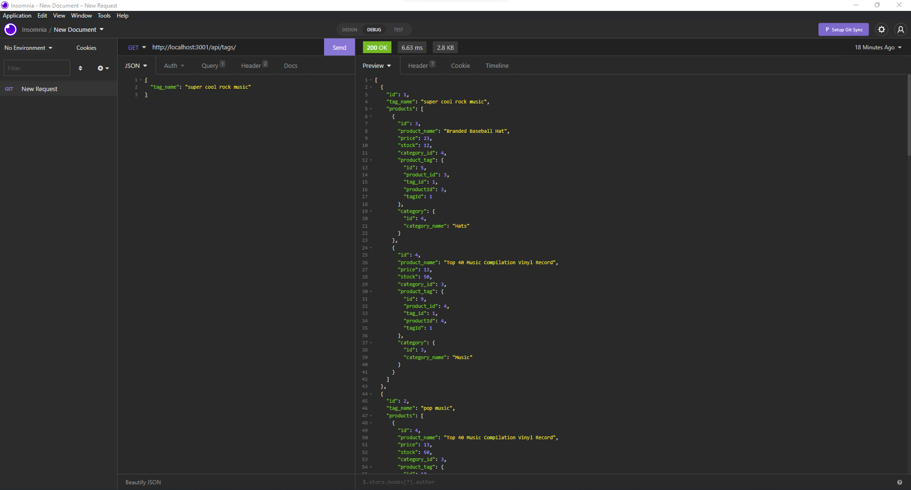
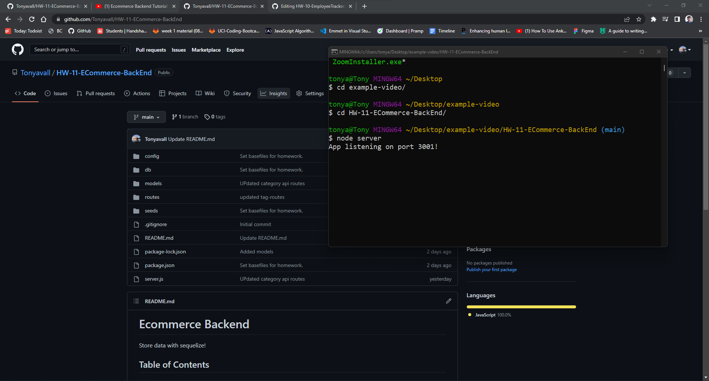

# Ecommerce Backend
Store data with sequelize!

## Table of Contents
- [Introduction](#introduction)
- [Application Preview](#application-preview)
- [Tech Stack](#tech-stack)
- [Installation](#installation)

## Introduction
Ecommerce related data such as items and their respective price, stock, name, category, and tag are stored in the backend using sequelize- an object relational mapper (ORM) for mysql2. Routing/Business logic is handled with express and the user can acquire and manipulate stored information through a series of GET, POST, PUT, and DELETE routes through Insomnia, etc, or through the browser (GET).

## Application Preview

## Tech Stack
Technologies used includes:
1. JavaScript (ES6)
2. Nodejs
3. Sequelize / MySql2
4. Express.js

## Installation

